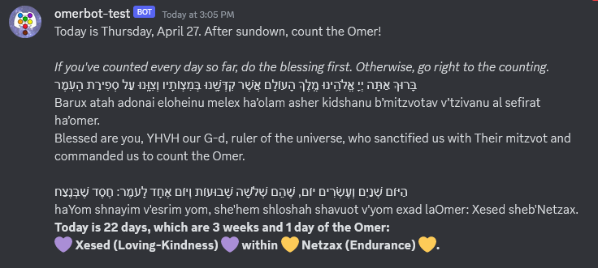

#  Omerbot 

Omerbot is a Discord bot to help you count the Omer! For every day of the Omer, at 6:00pm UTC, it posts a message with the upcoming day of the Omer, aspects for the day, and the blessing. 

Example post: 


This bot is adapted from Esther Alter's [Mishnahbot](https://github.com/subalterngames/mishnahbot). 
 
# Covenant

This software uses the MIT license, which you can read [here](LICENSE).

This software was originally made for [Shel Maala](https://www.shelmaala.com/) in order to enable the creation of the Queer Talmud. Alternative use cases, such as the study of the non-queer Talmud, are theoretically possible but not actively supported by the developers. Usage of this software to suppress the Queer Talmud is prohibited.

The user of this software may not be an individual or entity, or a representative, agent, affiliate, successor, attorney, or assign of an individual or entity, identified by the Boycott, Divestment, Sanctions ("BDS") movement on its website ([https://bdsmovement.net/](https://bdsmovement.net/) and [https://bdsmovement.net/get-involved/what-to-boycott](https://bdsmovement.net/get-involved/what-to-boycott)) as a target for boycott. *[Source: The Hippocratic License](https://firstdonoharm.dev/#hippocratic-license-3-0)*

# Requirements 
- On your working computer: git and Python 3.6 or newer. 
- Someplace where you can host the bot and run its cron job- a single-board computer like a Rasberry Pi or Odroid, a remote server, or some other always-on computer.
- On your hosting computer, Python 3.6 or newer.

# Setup 
## 1. Discord setup
  1. [In the Discord developer portal, create a Discord bot application.](https://www.wikihow.com/Create-a-Bot-in-Discord#Creating-the-Bot-on-Discord) Make sure to copy the bot token in step 5, you'll need it for file setup later! 
  1. [Get the OAuth2 client ID of the bot.](https://www.wikihow.com/Create-a-Bot-in-Discord#Sending-the-Bot-to-the-Discord-Server.2FChannel)
  1. [Get the Channel ID for the channel you want the bot to post to.](https://docs.statbot.net/docs/faq/general/how-find-id/) You'll need this for your file setup later!
  1. [Add the (currently empty) bot to the channel.](https://discord.com/oauth2/authorize?&client_id=1097236576062419085&scope=bot&permissions=8) Replace the client ID in this link with your bot's client ID. 

### Variation: How to add this bot to a server where you don't have admin privileges
  1. Get the Channel ID of the channel where you want it to post. Put it in the `"channel="` part of your `bot_secrets.txt` (see step 2.2 below).
  1. Tell someone who is an admin in that server to go to this link: [authorization link for your bot]( https://discord.com/oauth2/authorize?&client_id=1097236576062419085&scope=bot&permissions=8), then select the relevant server from the dropdown menu. 

## 2. Local computer 
  1. Clone this repo! the rest of this setup assumes that you've cloned it to `~/omerbot`.
  2. Create a file named `bot_secrets.txt` in the `~/omerbot` directory, formatted like this:
  ```
  token=BOT_TOKEN
  channel=CHANNEL_ID
  ``` 

## 3. Server/Hosting computer  
For setup with a traditional remote server, see [Mishnahbot's setup instructions](https://github.com/subalterngames/mishnahbot#setup). 

For setup with a little single-board computer, read on! 

### Hardware you will need: 
- Little Computer (LC) of some kind (Raspi, Odroid, etc.- i used an Odroid-C2) 
- Ethernet cable 
- Power cord for the little computer (usb or wall) 
- Working Computer (WC) that you used to program the bot (i.e. your laptop)
- Wifi router (the one that your Working Computer is currently using)

### Software you will need on your Working Computer: 
- IP address getter such as [Advanced IP Scanner](https://www.advanced-ip-scanner.com/) 
- SSH client such as [PuTTY](https://putty.org/)

### Steps: 
1. Plug the LC into the wifi router with the Ethernet cord, and into the wall with its power cord. 
1. On the WC: 
- Use the IP scanner application to find the IP address of the LC. 
- Use PuTTY to SSH to the LC.  
1. on the LC: 
```
mkdir ~/omerbot
mkdir ~/omerbot/omerbot
mkdir ~/omerbot/omerbot/data
vsftpd
```
this sets up the directories you need and starts the FTP server. 
1. on the WC again: 
```
cd ~/omerbot (or wherever you’re keeping your files)
ftp 
open <ip address of LC>
cd ~/omerbot
put setup.py run.py bot_secrets.txt omerbot/bot.py omerbot/data/omerdata.json
quit 
```
this uses FTP to copy the necessary files to the LC.
1. on the LC again: 
`su -` to become root, then test that the bot is working. 
```
cd omerbot/ 
python3 run.py 
```
1. set up the cron job for it. 
NOTE: my LC runs arch linux so it [wasn’t a cron job exactly.]( 
https://unix.stackexchange.com/questions/261864/arch-linux-how-to-run-a-cron-job) Here is the .service file contents for setting up on arch linux: 
 ```
 [Unit]
 Description=Post Omer reminder

 [Service]
 Type=simple
 ExecStart=/usr/bin/python3 /path/to/omerbot/run.py
```
After this, the bot should be ready to go! 


# Acknowledgements

Thanks to [Esther Alter](https://github.com/subalterngames) for creating Mishnahbot in the first place, and for her kindness and wisdom on Python, Discord bots, and more. 

Thanks to Meli for their [Omer-counting newsletter](https://buttondown.email/OmerCounter), which the format, text, and scheduling of this bot is based upon. 

Thanks to Tim for the borrowed cursed Odroid-C2, where this bot runs from Pesax to Shavuot.  